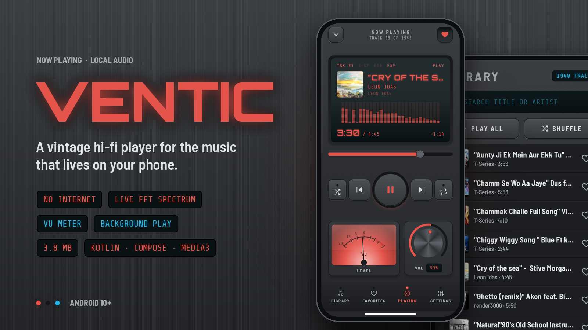

<p align="center">
  
</p>

<p align="center">
  <a href="https://github.com/yass-gr/Ventic/releases/latest"><b>⬇ Download the APK</b></a>
  &nbsp;·&nbsp; Android 10+ &nbsp;·&nbsp; 3.8 MB &nbsp;·&nbsp; no internet permission
</p>

# Ventic

Ventic is a music player styled like a piece of 70s hi-fi gear. It has a brushed-metal chassis, a glowing LCD, a 28-band spectrum analyser, a swinging VU needle and a rotary volume knob. It plays **only the music already on your phone**: no accounts, no streaming, no ads, no tracking. The app does not even request the `INTERNET` permission.

## Features

- **Instant library.** Every song on the device is read from Android's MediaStore and cached to disk, so your library is on screen from the first frame, even with thousands of tracks. Songs you add or delete are picked up automatically.
- **Real audio visualisation.** The spectrum bars and the VU needle are driven by a hand-written FFT that runs inside the audio pipeline. They react to the actual music and need no microphone permission.
- **The volume knob is your phone's volume.** Turn the knob and the media volume changes; press the volume keys and the knob turns, with a haptic detent at each step.
- **Background playback** with lock-screen and notification controls, audio focus, and pause on headphone unplug.
- **Library** with search, *Play all* and *Shuffle*. **Favorites** saved with one tap. **Now Playing** with shuffle, repeat-one and seek.
- **Themes:** a dark gunmetal or light cream-and-walnut chassis, with blue, amber, red or green accent lighting.
- **Remembers everything:** favorites, theme, accent, shuffle/repeat, the music-folder filter, and the last track with its exact position.

## Performance

Measured on a Redmi Note 10S (Android 13) with a 1,940-track library.

| | |
|---|---|
| Cold start | **370–540 ms** |
| APK size | **3.8 MB** (R8 + resource shrinking) |
| Animation | Spectrum, VU and seek bar redraw in the draw phase only, so there is no recomposition per frame |
| Audio analysis | Radix-2 FFT with no allocation on the audio thread, published at ~30 Hz |

## Install

Download `Ventic-v1.0.0.apk` from [Releases](https://github.com/yass-gr/Ventic/releases/latest), open it on your phone and allow installing from unknown sources. On first launch, grant access to your audio files.

> The release APK is signed with a development key. Android will install it normally, but updates must be signed with the same key.

## Tech stack

**Kotlin** · **Jetpack Compose** (foundation only, no Material) · **Media3 ExoPlayer + MediaSession** · DataStore · Coroutines/Flow · minSdk 29, targetSdk 36.

```
app/src/main/java/com/yass/vintageplayer/
├── data/       MediaStore library, binary cache, DataStore settings & favorites, album art
├── playback/   PlaybackService (ExoPlayer), MediaController connection, FFT level meter
└── ui/         theme tokens, skeuomorphic components, screens, ViewModel
```

## Build from source

Requirements: JDK 17+ and the Android SDK (platform 36).

```bash
git clone https://github.com/yass-gr/Ventic.git && cd Ventic
echo "sdk.dir=$HOME/Android/Sdk" > local.properties
./gradlew assembleRelease     # → app/build/outputs/apk/release/app-release.apk
./gradlew installDebug        # install on a connected device
```

## How it was made

The UI started as a Claude Design mock-up (`design/Main.component.html`). Its colour tokens, bevels, LED glows and spacing were ported directly to Compose. [`PLAN.md`](PLAN.md) covers the architecture and the build plan: the data, playback and design-system layers were implemented in parallel, then reviewed, merged and tested on a real device.

## Credits

Fonts: [Barlow Semi Condensed](https://fonts.google.com/specimen/Barlow+Semi+Condensed), [Orbitron](https://fonts.google.com/specimen/Orbitron) and [Share Tech Mono](https://fonts.google.com/specimen/Share+Tech+Mono), all under the SIL Open Font License 1.1 (see [`licenses/`](licenses)).
